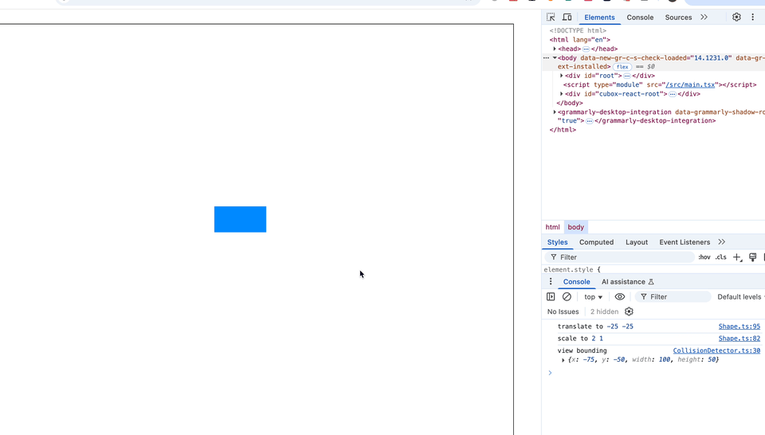

# Power Pencil

## Models

- **Shape**: : An abstract class for basic shapes that maintains rotation, translation, and scaling. Subclasses are responsible for computing AABB/OBB bounding boxes and implementing specific rendering logic.
- **Stage**:  The canvas model that maintains all shapes and the collision detection mechanism.
- **Camera**: Maintains the translation and scaling matrix of the view, and provides methods for transforming between world coordinates and view coordinates.
- **InteractionManager**: Handles basic user interactions and delivers event intents to the application layer.
- **CollisionDetector**: Retrieves the shape corresponding to a mouse event using a quadtree-based fast lookup mechanism.
- **BoardController**: Maintains the editing state of shapes, listens to user events, and applies transformations by invoking APIs on the Shape objects.

## Preview

